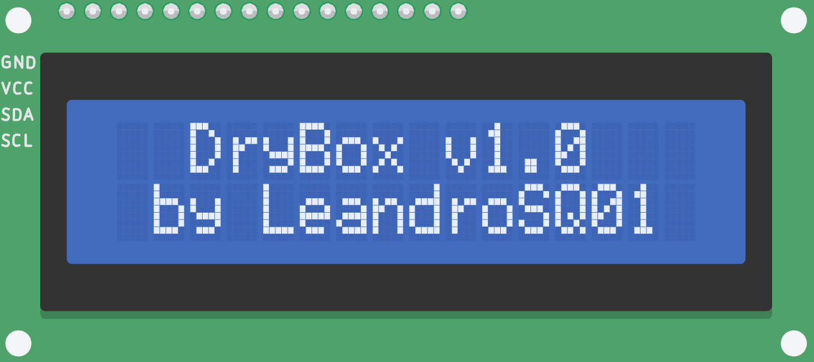
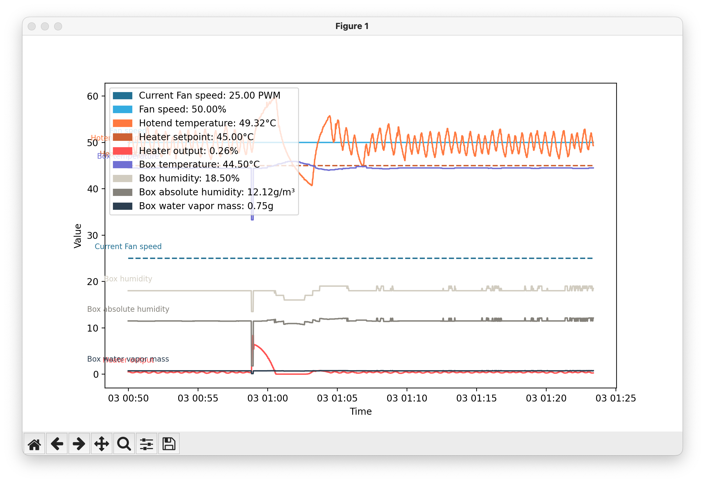
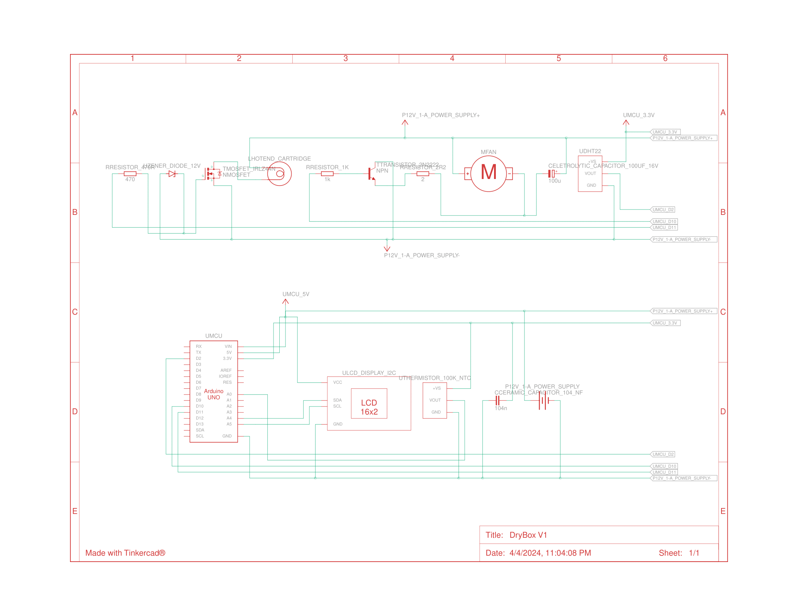
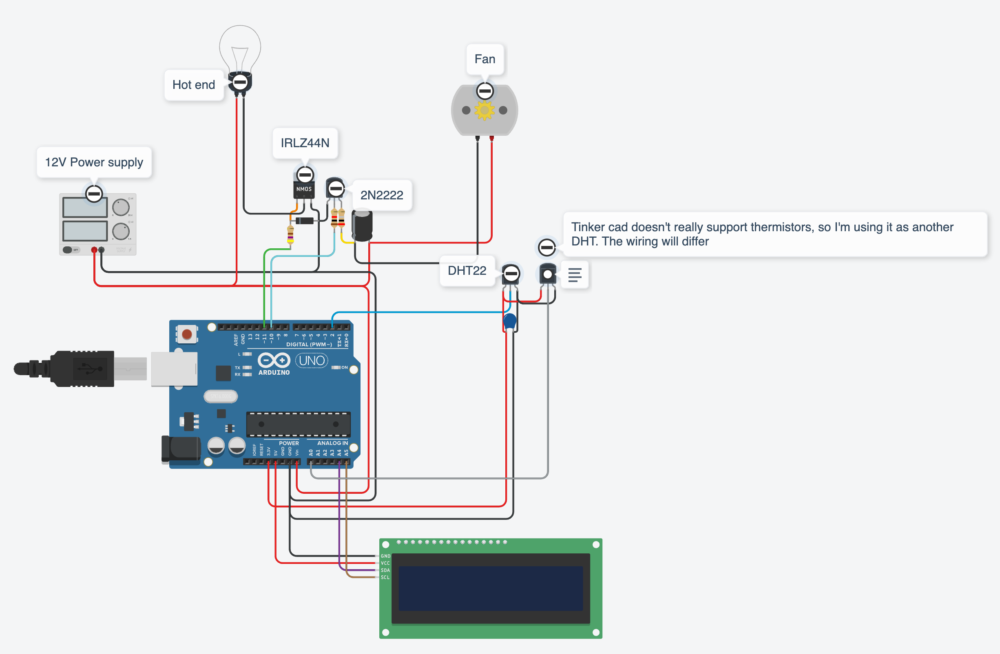

# DryBox

2 in 1 solution for Storing and Drying Filament for 3D printing.

This repo contains all the information I gathered while developing my DryBox. It is a work in progress, and I will keep updating it as I go.

<p align=center>
    
</p>

## Features

- [x] PID control of the temperature
    - [x] Feed forward control using the hotend temperature
        - After stabilizing the box temperature, I get .1ºC of error. I'm happy with that.
    - [x] Anti-windup
- [x] IO/Serial
  - Send values and readings to the serial port every X seconds
  - Receives serial commands such as:
    - `SETPOINT <value>` - Set the temperature setpoint
    - `PID <Kp> <Ki> <Kd> <FF>` - Tune the PID values
    - `FAN <value>` - Override the FAN speed
    - `HEATER <value>` - Override the Heater output
- [x] Home assistant integration
- [x] Silent FAN PWM control
- [x] Safety features
  - [x] Over temperature protection
  - [x] DHT sensor error detection
  - [x] Watchdog timer
- [x] Calculates absolute humidity and the water vapor mass inside the box
- [x] LCD 16x2 display using I2C
  - [x] Custom icons on the LCD display
- [x] Bowden tube from the box to the printer
- [  ] Filament runout sensor
  - Already bought, have to install

## Integrations

### Python

Under src/tools you can find a python script that enables realtime plotting and control of the DryBox.
<p align=center>
    
</p>
<p align=center>
    <small>Example while I was developing this</small>
</p>

### Home Assistant

Using template sensors you can integrate via USB/Serial the DryBox with Home Assistant. (Only if your board supports Serial communication, or you can use a TTL converter too)

```yaml
sensor:
  - platform: serial
    name: drybox
    serial_port: /dev/ttyACM1 # Replace with your port
    baudrate: 9600 # Replace with your baudrate
template:
  - binary_sensor:
    - name: "drybox_status"
      template: "{{ has_value('sensor.drybox') }}"
  - sensor:
      - name: "Fan Speed (PWM)"
        unit_of_measurement: "PWM"
        state: "{{ states('sensor.drybox').split(',')[0] | float(default=0) }}"
      - name: "Fan Speed"
        unit_of_measurement: "%"
        state: "{{ states('sensor.drybox').split(',')[1] | float(default=0) }}"
      - name: "Hotend temperature"
        unit_of_measurement: "ºC"
        state: "{{ states('sensor.drybox').split(',')[2] | float(default=0) }}"
      - name: "Heater setpoint"
        unit_of_measurement: "ºC"
        state: "{{ states('sensor.drybox').split(',')[3] | float(default=0) }}"
      - name: "Heater PID output"
        unit_of_measurement: "%"
        state: "{{ states('sensor.drybox').split(',')[4] | float(default=0) }}"
      - name: "Box temperature"
        unit_of_measurement: "ºC"
        state: "{{ states('sensor.drybox').split(',')[5] | float(default=0) }}"
      - name: "Box humidity"
        unit_of_measurement: "rh%"
        state: "{{ states('sensor.drybox').split(',')[6] | float(default=0) }}"
      - name: "Box absolute humidity"
        unit_of_measurement: "g/m³"
        state: "{{ states('sensor.drybox').split(',')[7] | float(default=0) }}"
```
<p align=center>
    <small>Into your <strong>configuration.yaml</strong></small>
</p>


## Hardware

| Component | Alternatives | Description |
| --- | --- | --- |
| MCU | Arduino Nano or ESP8266 | Controls everything |
| LCD 16x2 I2C | OLED 128x64 or TFT screen | Display the information, and looks cool |
| Temperature Sensor | DHT11, DHT22 or DS18B20 | Reads the temperature and humidity inside the box |
| FAN | 12V 80mm | Moves the air inside the box |
| Heatsink | 80x80x10mm | Used to increase the surface area and heat more air in contact |
| 3d printer hotend cartridge | - | Used to heat the air inside the box |
| 3d printer hotend block | - | Used to attach the cartridge and thermistor to the heatsink block |
| 100K NTC Thermistor | - | Used to read the temperature of the hotend |
| 12V 5A~ power supply | I'm using one with 10A here just to be sure | Powers the whole thing |
| 5V to 3.3V Buck Converter | Not really needed if your board already has a tension regulator embedded | Found that DHT sensors work better at 3.3v |
| IRLZ44N | - | Used to control the heater output voltage using PWM |
| 2N2222 | - | Used to control the FAN output voltage using PWM |
| Resistors, capacitors, connectors, etc | - | - |
| 3/16" screws, washers and nuts | - | Used to hold parts onto the box |
| 60L Foam box | - | Used to isolate the air inside the box |
| 3D printed parts | - | Used to hold the parts together |
| PU glue | - | Used to fill holes and ensure the seal |
| Foam glue | - | Used to glue 3D printed parts into the box |
| M10 bowden connectors | M6 bowden, but I have heard they introduce friction on the filament | Used to connect attach a PTFE tube from the box to the printer |
| PTFE tube | - | Used to connect the box to the printer |

Some other stuff that helps:

- Hot glue gun
- IR Thermal gun
- Multimeter
- Soldering iron
- 3D printer (duh)

And some other stuff I forgot to mention here.

## Notes

I printed everything with PLA, given that the temperatures should not exceed 60ºC inside the box, it should be fine. But while developing this I had an issue where the box stayed at 70ºC for a long time, and the fan support made with PLA started to deform. It still works, but probably a better idea to print in PETG or ABS ASA.

The PLA I used was HT, but I did not perform the cristalization process, so it is not as strong as it could be.

## Circuit

<p align=center>
    
</p>
<p align=center>
    <small>Schematic</small>
</p>

<p align=center>
    
</p>
<p align=center>
    <small>Overview</small>
</p>

<details>
 <summary>Click here to see the components (Generated from Tinkercad)</summary>
 <table class="table table-bordered table-hover table-condensed">
  <thead>
   <tr>
    <th title="Field #1">Name</th>
    <th title="Field #2">Quantity</th>
    <th title="Field #3">Component</th>
   </tr>
  </thead>
  <tbody>
   <tr>
    <td>MCU</td>
    <td align="right">1</td>
    <td>Arduino Uno R3</td>
   </tr>
   <tr>
    <td>12v 10A Power Supply</td>
    <td align="right">1</td>
    <td>12 , 10 Power Supply</td>
   </tr>
   <tr>
    <td>MOSFET IRLZ44N</td>
    <td align="right">1</td>
    <td>nMOS Transistor (MOSFET)</td>
   </tr>
   <tr>
    <td>Transistor 2N2222</td>
    <td align="right">1</td>
    <td>NPN Transistor (BJT)</td>
   </tr>
   <tr>
    <td>Zener Diode 12v</td>
    <td align="right">1</td>
    <td>12 V Zener Diode</td>
   </tr>
   <tr>
    <td>RResistor 470R</td>
    <td align="right">1</td>
    <td>470 Ω Resistor</td>
   </tr>
   <tr>
    <td>Resistor 1k</td>
    <td align="right">1</td>
    <td>1 kΩ Resistor</td>
   </tr>
   <tr>
    <td>Resistor 2R2</td>
    <td align="right">1</td>
    <td>2 Ω Resistor</td>
   </tr>
   <tr>
    <td>Eletrolytic Capacitor 100uF 16V</td>
    <td align="right">1</td>
    <td>100 uF, 16 V Polarized Capacitor</td>
   </tr>
   <tr>
    <td>DHT22, UThermistor 100K NTC</td>
    <td align="right">2</td>
    <td>Temperature Sensor</td>
   </tr>
   <tr>
    <td>Fan</td>
    <td align="right">1</td>
    <td>DC Motor</td>
   </tr>
   <tr>
    <td>Hotend cartridge</td>
    <td align="right">1</td>
    <td>Heater</td>
   </tr>
   <tr>
    <td>Ceramic Capacitor 104 nF</td>
    <td align="right">1</td>
    <td>104 nF Capacitor</td>
   </tr>
   <tr>
    <td>LCD Display I2C</td>
    <td align="right">1</td>
    <td>PCF8574-based, 39 (0x27) LCD 16 x 2 (I2C)</td>
   </tr>
  </tbody>
 </table>
</details>

I have a KiCad schematic for my PCB somewhere, someday I will upload it here :p

## Resources:

### Inspiration

- Marlon Nardi's [video](https://www.youtube.com/watch?v=Z5tCAvwi9p4&t=370s) DryBox project which I took heavy inspiration from
- Mighty studio's [video](https://www.youtube.com/watch?v=R93u8XLAhz8) another DryBox project which I took heavy inspiration from
- 3DMaker's [Commercial DryBox](https://www.youtube.com/watch?v=S7JMmGDJ5gU)
- Ricky Impley's [amazing essay on Dryers](https://www.youtube.com/watch?v=8ET9EJrA0v0)
- METER Group [video](https://www.youtube.com/watch?v=EXjbjIgTgsA) about absolute humidity

### OSS Projects

- Sam Knight's [PWM.h](https://forum.arduino.cc/t/pwm-frequency-library/114988)
- Max Mayfield's Thermistor2. Which I can't find the original source anymore.
- Adafruit's [DHT sensor library](https://github.com/adafruit/DHT-sensor-library)
- Max Promer's [LCD Custom Character Creator](https://maxpromer.github.io/LCD-Character-Creator/) which I used to create the custom icons for the LCD display